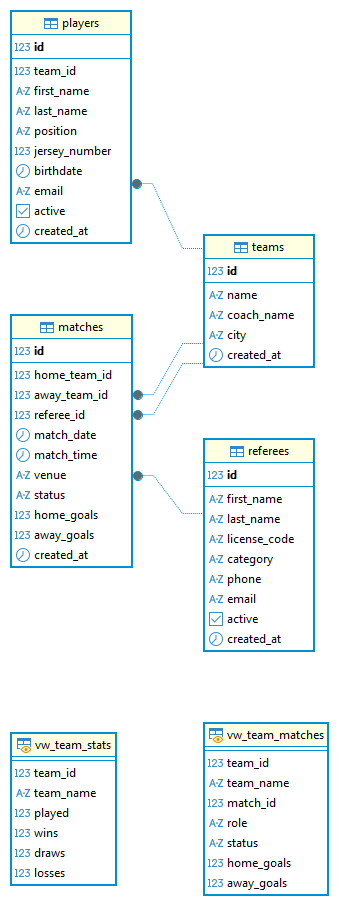

# 🧾 Documentación Base de la Base de Datos – SIGET

**Proyecto:** Sistema de Información y Gestión de Torneos (SIGET)  
**Asignatura:** Bases de Datos  
**Docente:** Ing. Hely Suárez Marín  
**Institución:** Fundación de Estudios Superiores Comfanorte – FESC  
**Integrantes:**  
- Nelly Fabiola Cano Oviedo  
- Néstor Iván Granados Valenzuela  
**Fecha:** Octubre / 2025  

---

## 1️⃣ Introducción

El proyecto **SIGET** busca optimizar la gestión de torneos deportivos en contextos académicos y amateurs.  
Actualmente, muchas instituciones registran información en hojas de cálculo y grupos de mensajería, lo que ocasiona duplicidad de datos, errores en resultados y pérdida de trazabilidad.  

Esta documentación detalla el diseño e implementación de la **base de datos relacional** que sustenta el sistema SIGET.  
El modelo garantiza integridad referencial, consistencia de datos y soporte para la generación automática de estadísticas del torneo.

---

## 2️⃣ Modelo Conceptual (Entidad–Relación)

El **modelo conceptual** define las entidades principales del dominio y sus relaciones.  
Cada entidad representa un actor o componente esencial del torneo.

### 🧱 Entidades Principales

| Entidad | Descripción |
|----------|--------------|
| **Team** | Representa a un equipo participante (nombre, ciudad, entrenador). |
| **Player** | Jugador perteneciente a un equipo, con información personal y posición. |
| **Referee** | Árbitro habilitado para dirigir partidos, con licencia y estado activo. |
| **Match** | Partido entre dos equipos, con árbitro asignado, fecha, hora y marcador. |

### 🔗 Relaciones Clave

| Relación | Tipo | Descripción |
|-----------|------|--------------|
| Team — Player | 1:N | Un equipo tiene muchos jugadores. |
| Team — Match (local) | 1:N | Un equipo puede ser local en varios partidos. |
| Team — Match (visitante) | 1:N | Un equipo puede ser visitante en varios partidos. |
| Referee — Match | 1:N | Un árbitro puede dirigir varios partidos. |

### 📊 Diagrama ER


---

## 3️⃣ Modelo Lógico (Relacional)

El **modelo lógico** traduce las entidades y relaciones del ER a tablas con llaves primarias, foráneas y restricciones de integridad.

| Tabla | Descripción |
|--------|--------------|
| `teams` | Almacena los equipos participantes. |
| `players` | Contiene los jugadores y su pertenencia a equipos. |
| `referees` | Registra árbitros activos e información de contacto. |
| `matches` | Registra los partidos programados, sus resultados y estado. |

### ⚙️ Esquema Relacional



---

## 4️⃣ Normalización

El diseño cumple con la **Tercera Forma Normal (3FN)** garantizando integridad y evitando redundancia.

| Forma Normal | Cumplimiento | Ejemplo |
|---------------|--------------|----------|
| **1FN** | Todos los atributos son atómicos. | Cada jugador tiene un solo número de camiseta. |
| **2FN** | Todos los atributos dependen completamente de la PK. | `team_id` depende solo de `players.id`. |
| **3FN** | No hay dependencias transitivas. | `email` pertenece a la entidad árbitro, no a otra. |

📘 *Las estadísticas no se almacenan directamente; se calculan dinámicamente desde los partidos jugados.*

---

## 5️⃣ Restricciones y Reglas de Negocio

| Tipo | Tabla | Restricción | Descripción |
|------|--------|-------------|--------------|
| **CHECK** | matches | `home_team_id <> away_team_id` | Evita partidos con el mismo equipo. |
| **CHECK** | matches | `home_goals >= 0 AND away_goals >= 0` | Goles no negativos. |
| **CHECK** | matches | `status ∈ {scheduled, played, cancelled}` | Controla el ciclo de vida del partido. |
| **UNIQUE** | teams | `name` | No permite equipos duplicados. |
| **UNIQUE** | referees | `license_code`, `email` | Cada árbitro debe ser único. |
| **FOREIGN KEY** | players | `team_id → teams(id)` | Cada jugador pertenece a un equipo. |
| **FOREIGN KEY** | matches | `referee_id → referees(id)` | Cada partido tiene un árbitro asignado. |

---

## 6️⃣ Implementación SQL

El diseño fue implementado para **PostgreSQL 14+** y **MySQL 8+**, garantizando compatibilidad con ambos motores.

| Motor | Archivo | Descripción |
|--------|----------|-------------|
| PostgreSQL | `db/dumps/postgres/siget_schema.sql` | Esquema base con constraints y vistas. |
| PostgreSQL | `db/dumps/postgres/siget_schema_data.sql` | Inserciones demo para pruebas. |
| MySQL | `db/dumps/mysql/siget_schema.sql` | Esquema equivalente con ENUM y CHECK. |
| MySQL | `db/dumps/mysql/siget_schema_data.sql` | Datos de muestra. |

### 🔍 Tablas Principales

```sql
CREATE TABLE teams (
  id SERIAL PRIMARY KEY,
  name VARCHAR(100) UNIQUE NOT NULL,
  coach_name VARCHAR(100),
  city VARCHAR(80)
);

CREATE TABLE matches (
  id SERIAL PRIMARY KEY,
  home_team_id INT REFERENCES teams(id),
  away_team_id INT REFERENCES teams(id),
  referee_id INT REFERENCES referees(id),
  match_date DATE,
  match_time TIME,
  status ENUM('scheduled','played','cancelled'),
  home_goals INT CHECK (home_goals >= 0),
  away_goals INT CHECK (away_goals >= 0)
);

## 8️⃣ Diagramas UML Asociados

Aunque esta documentación se centra en la **base de datos**, los siguientes **diagramas UML** complementan la comprensión técnica del sistema:

| **Diagrama** | **Propósito** | **Archivo** |
|---------------|----------------|--------------|
| **Clases** | Estructura del dominio (entidades y relaciones). | `../images/png/class.png` |
| **Casos de Uso** | Funciones principales del sistema (registro, programación, resultados). | `../images/png/usecase.png` |
| **Estados** | Ciclo de vida de un partido. | `../images/png/state_match.png` |

---

## 9️⃣ Ejecución y Verificación

Para garantizar la correcta implementación de la base de datos y sus vistas, se deben seguir los siguientes comandos según el gestor utilizado.

### 🐘 PostgreSQL

```bash
psql -U postgres -d tournament_db -f db/dumps/postgres/siget_schema.sql
psql -U postgres -d tournament_db -f db/dumps/postgres/siget_schema_data.sql

### 🐬 MySQL

```bash
mysql -u root -p tournament_db < db/dumps/mysql/siget_schema.sql
mysql -u root -p tournament_db < db/dumps/mysql/siget_schema_data.sql

### 🔍 Comprobación rápida

Para validar la vista y verificar los datos generados, ejecutar:

```sql
SELECT * FROM vw_team_stats;

---

## 🔟 Conclusiones

La base de datos del **Sistema SIGET** cumple con los **principios fundamentales del diseño relacional**, garantizando:

- 🔗 **Integridad referencial** en todas las relaciones.  
- 📊 **Obtención confiable** de métricas sobre el desempeño de los equipos.  
- ⚙️ **Escalabilidad** y facilidad de mantenimiento.  
- 🧩 **Coherencia** entre la capa de persistencia y la lógica de negocio.  

El uso de **restricciones**, **vistas** y **normalización avanzada** asegura la **calidad**, **consistencia** y **trazabilidad** de los datos dentro del sistema.

> 🧠 Este modelo constituye la **columna vertebral del proyecto SIGET**, sirviendo como base sólida para el desarrollo de las capas **lógica** y **de presentación**.
